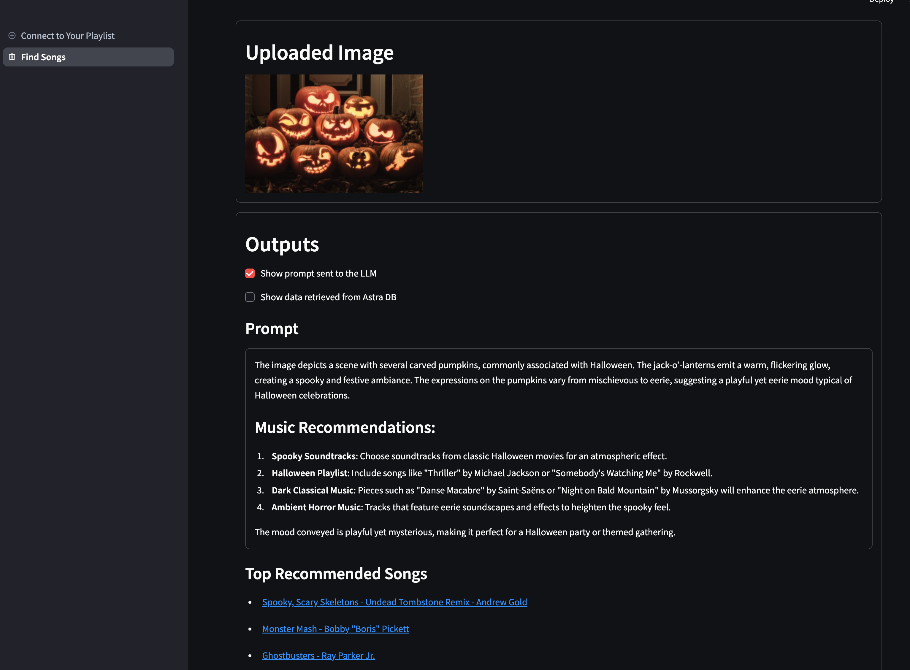
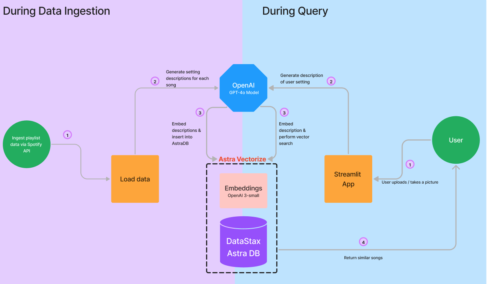
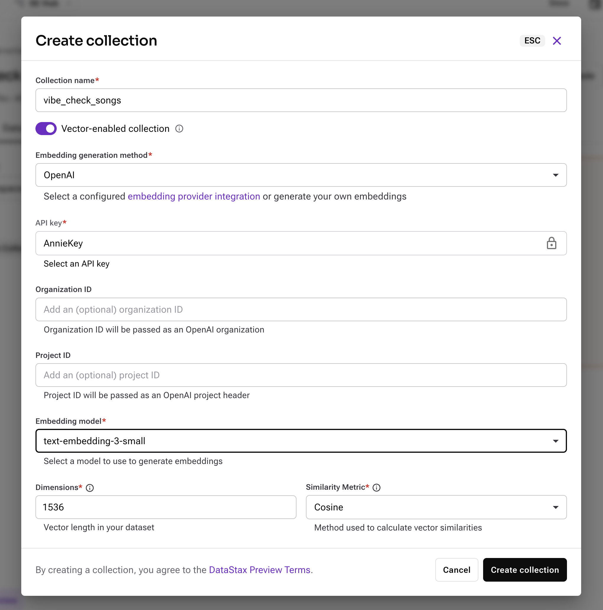
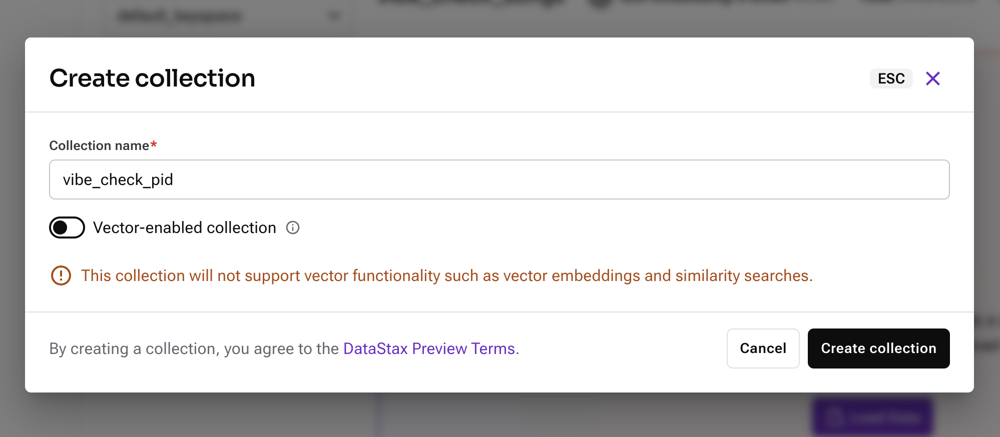

# Vibe Check - Multimodal Music Search Application

### Intro:
Struggling to find the perfect soundtrack for every moment? Whether you're powering through a workout, setting the mood for a Halloween party, or studying for a big exam, having the right songs playing can make all the difference. Vibe check allows you to upload images/text and receive curated songs based on your vibe!




### Overview:
This repository uses DataStax Astra DB, OpenAI, and the Spotify API to perform vector similarity searches and multi-modal Retrieval Augmented Generation (RAG).

#### Ingestion
How does this application ingest Spotify song data?
1. We send a playlist ID to the the Spotify API and retrieve a full list of the song names, artists, and song IDs for each song in that playlist.
2. We iterate through every song in the playlist and sends the song name and artist to an LLM in order to generate matching setting descriptions. This is the prompt template that we used for this step:
```
You are an AI agent that helps users determine what songs to play to match their setting.
Based on the included song name and artist, '{song_name}' by '{artist_name}', write up
a description of what kind of setting would be appropriate to listen to.
Do not make assumptions based purely on the song name, you should try to use
real information about the song to come up with your setting description.
```
3. We send the song data + song descriptions to our vectorize-enabled collection in Astra DB. Embeddings are generated using the vectorize integration while we are loading the data.

#### Querying
How does this application make song recommendations?
1. We take photo input from the camera or file uploader and send this image to a multimodal LLM. The LLM generates setting descriptions that match the vibe depicted in the image. Here is the prompt we used to generate the setting description:
```
You are an AI agent that helps users find music that matches their current setting.
Please describe the ambiance and vibe of the included image. 
What types of music would be fitting for this setting? 
What kind of mood is conveyed in the image?
```
2. We combine the generated setting description with any optional additional text input from the user. This full setting description is used to query the database, which returns the top 5 songs from the database with descriptions that match the query.
3. We display these songs and inlude links to each song on Spotify.

#### Architecture Diagram


You can also view the code for this project and run it yourself in this [Google Colab](https://colab.research.google.com/drive/1Y3R5HO6SH5-IzMItbZSmCT8L08d4aEri).


### Before you get started:
Make sure you have the following:


*   Astra DB account. You can sign up for a free account [here](https://astra.datastax.com/signup?utm_medium=email&utm_source=datastax&utm_campaign=music_search_livestream&utm_content=astra_sign_up)
*   OpenAI Account
*   Spotify Account with a playlist


### How to run it on your own machine

1. Install the requirements

   ```
   $ pip install -r requirements.txt
   ```

2. Gather your credentials. 
   
   Create a copy of `example.secrets.toml` and name it `secrets.toml`. You will replace the credentials there with your own.
   - [Create a vector database in Astra](https://docs.datastax.com/en/astra-db-serverless/get-started/quickstart.html#create-a-serverless-vector-database). It will take a few minutes to become active. Once it is active you can then retrieve your ASTRA_DB_API_ENDPOINT and ASTRA_DB_APPLICATION_TOKEN from your Database Details section.
   - ASTRA_DB_COLLECTION_NAME and ASTRA_DB_PID_COLLECTION_NAME will be set in the next step.
   - SPOTIFY_CLIENT_ID and SPOTIFY_CLIENT_SECRET: [Create a Spotify App and retrieve your Spotify Client ID and Client Secret](https://developer.spotify.com/documentation/web-api/concepts/apps).
   - OPENAI_API_KEY: [Create an OpenAI API key and save it](https://platform.openai.com/docs/quickstart). In order to avoid errors or rate limits, you may have to add some balance to your OpenAI API account. Please see the instructions for adding a payment method to OpenAI for the API [here](https://help.openai.com/en/articles/9038407-how-can-i-set-up-billing-for-my-account).
   

3. Set up your collections using Astra Vectorize
   - With your OpenAI API key, [follow these steps to integrate OpenAI as an embedding provider for Astra DB](https://docs.datastax.com/en/astra-db-serverless/integrations/embedding-providers/openai.html). Make sure that your new database is within the scope of your newly added API key. This example uses the OpenAI vectorize integration, but you can use a different embeddings model if preferred. This code uses OpenAI GPT-4o to generate text, so you do still need the OPENAI_API_KEY in order to run the code as-is.
   - Now that your integration is set up, you can create your collections using the integration. 
      - In the Data Explorer, create a new vector collection for your songs and give it a meaningful name. This will be your ASTRA_DB_COLLECTION_NAME.
      
      - Also create a new non-vector collection for tracking the current Playlist ID in your app, and give it a meaningful name. This will be your ASTRA_DB_PID_COLLECTION_NAME.
      
   - You should now have everything needed in your secrets.toml file to run the application!

4. Run the app

   ```
   $ streamlit run streamlit_app.py
   ```

### What Next?

If you want to deploy your application on Streamlit Community Cloud, [follow these instructions](https://docs.streamlit.io/deploy/streamlit-community-cloud/deploy-your-app/deploy).

Have any questions or suggestions for this project? 
Submit an issue to the repository, or message us on the [DataStax Developers Discord](https://discord.gg/datastax)! 
